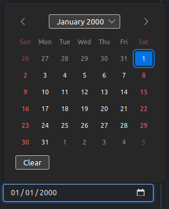
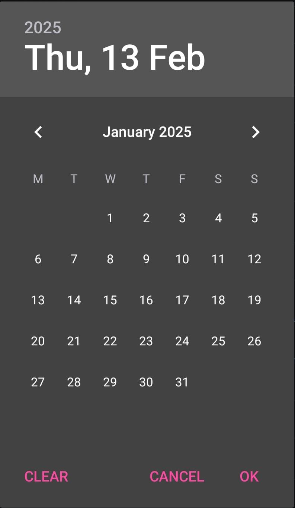
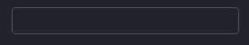

# Formulários

Sem dúvidas, os formulários do Django facilitam a entrega de funcionalidades com pouco esforço.

## Inputs de data
Existem, basicamente, duas formas de criar inputs de data e a escolha depende, essencialmente, de quem terá o controle das funcionalidades.

1. A primeira opção é quando o controle de data deve ocorrer pelo navegador:

    ``` py 
    date_field = forms.DateField(
        widget=forms.DateInput(
            attrs={
                "type": "date"
            }
        )
    )
    ```
    Neste cenário, Django tem pouco controle do que ocorre ali porque `DateInput` será um `<input type="date">` e o navegador aplicará as regras dele.
    No Firefox, por exemplo, isso será renderizado com um botão que permitirá o usuário selecionar uma data sem precisar digitar todos os campos.
    <figure markdown="span">
        { width="300" }
        <figcaption>O navegador decide como exibir o input e como a seleção de data ocorrerá (Firefox no desktop)</figcaption>
    </figure>
    O locale do input também ficará a critério do navegador, então se ele foi configurado para português brasileiro, provavelmente o padrão será `DD/MM/AAAA`, mas, se for inglês americano, o padrão será `MM/DD/AAAA`.

    **Observação**: como o navegador está ciente que o `input` é uma data, ele garante que o que for digitado será válido no locale do usuário, ou seja, não será permitido digitar, por exemplo, `50/02/2000`. Além disso, se o usuário estiver usando um navegador no celular, o seletor nativo ajuda a pessoa a selecionar datas com mais facilidade do que digitar no teclado.
    <figure markdown="span">
        { width="300" }
        <figcaption>Como um input de data se comporta (Firefox no Android)</figcaption>
    </figure>


1. A segunda opção é colocar o controle do input para o Django:

    ``` py
    date_field = forms.DateField(
        input_formats=["%d/%m/%Y"],
        widget=forms.DateInput(),
    )
    ```
    Neste cenário, Django tem maior controle do input. No código acima, `input_formats` recebe uma lista de possíveis formas de se inserir a data.

    Imagine um cenário em que, por algum motivo, se quer exibir o input sempre no padrão `DD/MM/AAAA` independente do locale do navegador do usuário, então a segunda opção permitirá adicionar essa funcionalidade. O formato poderia ser de outras formas, por exemplo: `%m/%y` para aceitar apenas mês e ano (com dois dígitos).

    <figure markdown="span">
        { width="300" }
        <figcaption>O navegador exibirá apenas como um input do tipo `text`</figcaption>
    </figure>
    A desvantagem é que, como o navegador não sabe que aquilo é um `date`, ele não consegue fornecer uma ferramenta de seleção de data. Além disso, um `placeholder` e possivelmente máscara seriam úteis também para minimizar essa desvantagem.

    O exemplo abaixo minimiza esses efeitos:
    ``` py
    date_field = forms.DateField(
        input_formats=["%m/%d/%Y"],
        widget=forms.DateInput(
            attrs={
                "class": "form-control",
                "x-mask": "99/99/9999",
                "x-data": "",
                "placeholder": "DD/MM/AAAA",
                "type": "text" # (1)
            }
        )
    )
    ```

    1.  `type text` é o valor padrão, então é opcional informar. Se quiser o tipo `date`, então é obrigatório informar.

    **Observação**: o exemplo acima não garante que o usuário digite uma data inválida, por exemplo `90/60/0001`, apenas aplicará uma máscara que impede caracteres diferentes de números de serem digitados.

    Na validação do Django, isso será barrado, mas o usuário terá a liberdade de digitar o que quiser - isso não ocorre com a primeira opção porque o navegador sabe que não existe um mês `60`, por exemplo.